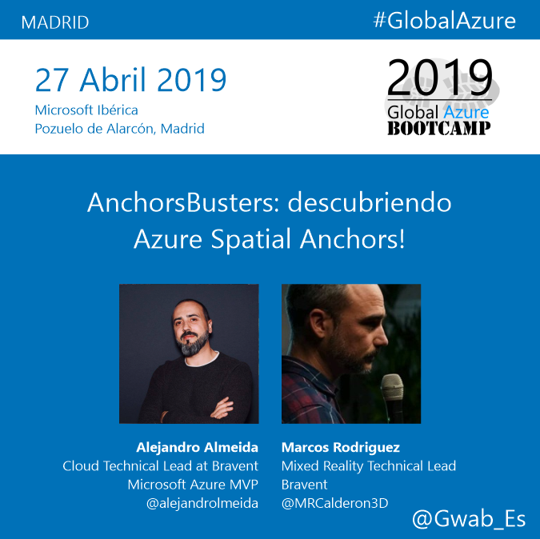

# **AnchorBusters: discovering Azure Spatial Anchors!**

The Microsoft Mixed Reality stack has arrived at Azure to provide us with new PaaS services that allow the developer to improve the capabilities of our XR scenes.

Azure Spatial Anchors is one of these amazing services that allows us to solve the classic problems during the sharing of holograms in multi-device experiences in the same physical space.

This repository contains all resources used for my session at the Global Azure Bootcamp 2019 in Madrid, named: "AnchorBusters: discovering Azure Spatial Anchors!"

During this session we will discover the technical aspects of this service and its ability to integrate technologies present in current operating systems such as ARKit (Android), ARCore (iOS), and UWP (Hololens).

To liven up the session we will develop a multi-device experience (Hololens + Android) where players can join together to hunt as a team some terrifying ghosts!
